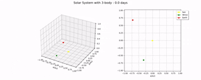

Simulation of the N-body problem applied to the solar system using the APi horizon from NASA

# Simulation of the N-body problem 🪐
This contains the resolution of the N-body problem using the BDF method to resolve the ODE (ordinary diferential equations) system, specificaly using the function from scipy.integrate, solve_ivp. The only complex part of this to have a clear formulation of the N-equations for Newton´s gravitational law. Once i have this, the next step is to create a function that can generate dinamicaly gravitational equations, taking into account the number of bodies.
When this is done, the rest is simple. I created classes to add bodies to this system, for example:

```
sesion=session()
sesion.add_body(1,np.array(inital_velocity_1),np.array(inital_position_1),'Planet 1')
sesion.add_body(1,np.array(inital_velocity_2),np.array(inital_position_2),'Planet 2')
sesion.add_body(1,np.array(inital_velocity_3),np.array(inital_position_3),'Planet 3')
sesion.info()
sol=sesion.plot_solution(t_span,t_points)
```
This process can be seen in this [notebook](Notebooks/N_body_resolution.ipynb).

# Calling the Horizon API
There is a better validation of this than using the real data from NASA? I created some functions that call the API and process the data. Then i created one class that store the relevant data. For example, you can tho this:
```
earth=bodyAPI(name='Earth',date='2024-02-06')
sun=bodyAPI(name='Sun',date='2024-02-06')
sesion=session()
sesion.add_body(earth.gmfactor,earth.velociy,earth.position,earth.name,normalized=True)
sesion.add_body(sun.gmfactor,sun.velociy,sun.position,sun.name,normalized=True)
sesion.info()
```

# [Main](main.py)
Here, there is an automated version of all the implementation. You can specify the number of bodies (up to 10) and you will get a video of the simulation.
<div align="center">
  <p><strong>3-Body Example</strong></p>
  
</div>

# Results
In the [notebook](Notebooks/N_body_resolution.ipynb) there can be found very good results. For 4 bodies, Sun-Earth-Moon-Jupiter, the results for a forecast of 350 days are less than 3% compared to the real data. With 8 bodies this results improved in the XY plane but gotten worse in the Z axis. Then i checked that Mercury was the causer of this, due to perturbations in his precesion orbit caused by the general relativy, without him, improved again in this axis.

<div align="center">

| N-Body   | X error (%) | X error (%) | Y error (%)
|:-------:|:----------:|:---------------:|:---------------:|
| 4    | 3.1274      | 2.0301        |2.2071    |
| 8 | 0.0121    | 0.1622          | 78.0357 |
| 7 (No Mercury) | 3.7567    | 2.0018          |  3.1091  |
</div>